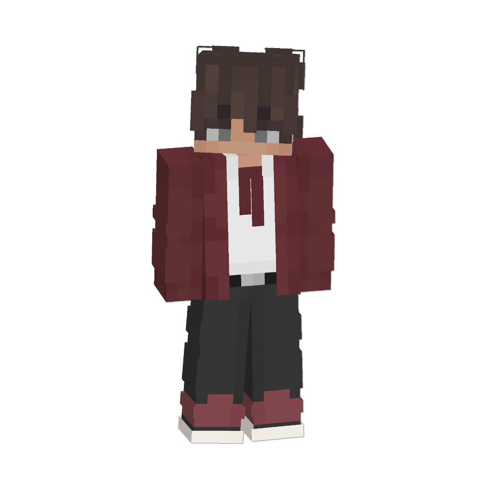

<link rel="stylesheet" href="styles.css">

<h1 align="center">ABOUT ME</h1>

  

  

    <h2>Hello, I'm Nperma</h2>
    
born in indonesia, experience in minecraft bedrock addons

        
Part of the Minecraft Bedrock Addons and Minecraft Development Indonesia community

        
Creator of Stool-API and QwoUI

        
Based on ScriptAPI and JSON UI

    
Thanks for visiting my profile

  

 

## GitHub Stats

  
 
  
 
  
 
  

